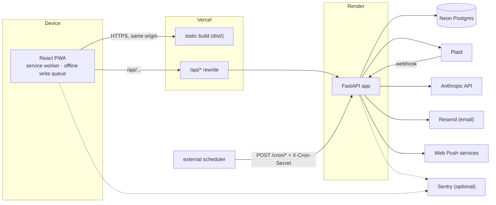
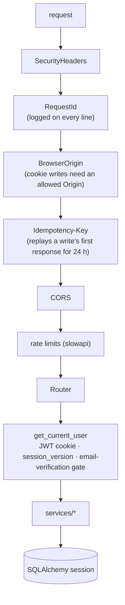
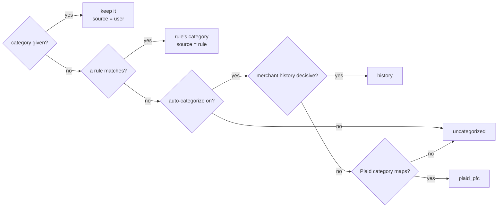
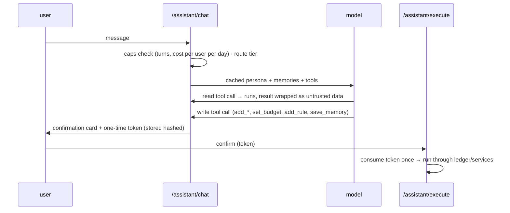
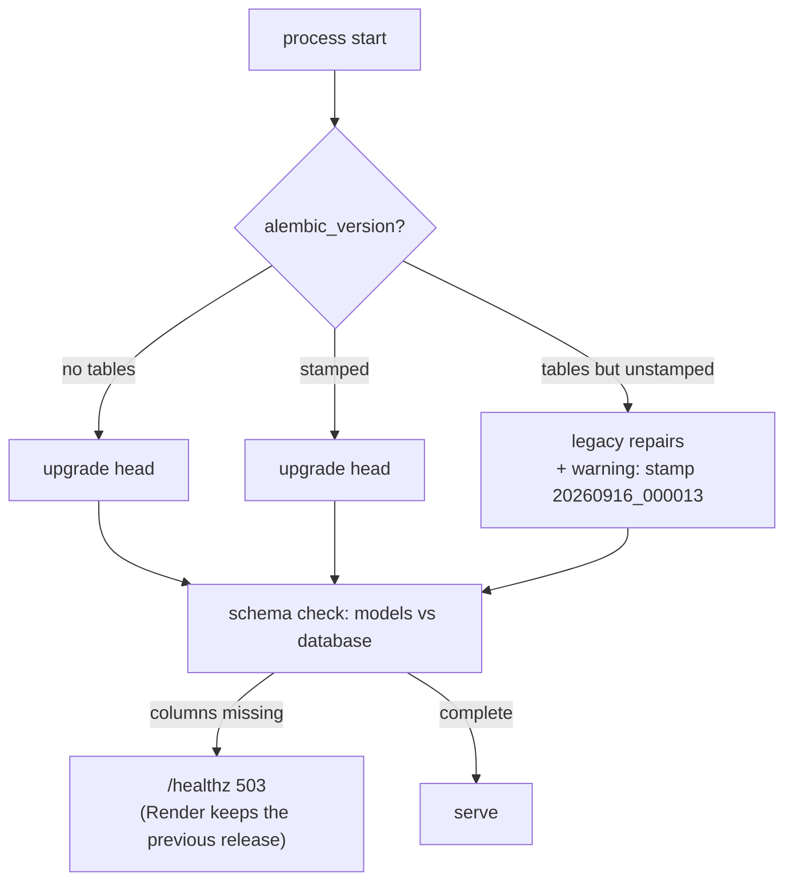

# Architecture

How Fintrack is put together, and the few invariants every change must keep.

## System context



The browser only ever talks to its own origin: Vercel serves the build and forwards `/api/*` to Render, so the session lives in HttpOnly cookies and there is no cross-site credential handling.

## Request path (backend)



- Every router scopes its queries to `current_user.id`; `tests/test_tenant_isolation.py` and `test_tenant_isolation_jobs.py` prove it route by route and for cron, jobs, push and assistant tools.
- Collection reads send ETags; the client caches and revalidates.
- The client queues writes offline and replays them with the same `Idempotency-Key`, so a retry cannot post twice.

## The ledger

Every transaction write goes through `LedgerService.stage_transaction`: manual entry, the assistant, recurring posting, savings spends and CSV import. It checks ownership, runs enrichment, and moves the balance with a SQL expression (`balance = balance + delta`), so concurrent writers never overwrite each other.

Category precedence, decided in one place (`services/transaction_enrichment.py`):



**Splits** (`services/splits.py`) never move money. Lines add up exactly to the parent, and the parent keeps the largest line's category. Budgets, the assistant's category totals and the analytics category views read the lines. An amount change, recategorizing the whole transaction, or a bank revision drops the split.

## Bank sync

```mermaid
sequenceDiagram
  participant P as Plaid
  participant W as /plaid/webhook
  participant S as sync (background)
  participant DB as Postgres
  P->>W: SYNC_UPDATES_AVAILABLE
  W->>S: schedule sync(item)
  loop each page (cursor committed per page)
    S->>P: /transactions/sync
    S->>DB: added → enrich → INSERT … ON CONFLICT DO NOTHING (pending skipped)
    S->>DB: modified → update; amount revised ⇒ drop split lines
    S->>DB: removed → delete
  end
  S->>DB: reconcile recurring bills
  S->>DB: budget + low-balance checks (once per month / once per dip)
  S-->>P: (next page)
```

Sync health for each item (last source, counts, errors) is recorded and shown in Settings → Connections.

## Assistant



The model never writes anything directly. Every change is a pending action that the person confirms.

## Sign-in

- A password alone creates the session (access and refresh JWTs in HttpOnly cookies, bound to `session_version`).
- If 2FA is on, the password returns a 5-minute challenge instead. `/auth/login/2fa` accepts a TOTP code or a recovery code.
- Failed passwords and failed codes each have a database-backed lockout.
- Enabling 2FA or resetting the password bumps `session_version`, which signs out every other session.

## Schema and boot



- Revisions are additive and guarded, so each one is correct on a database built by the chain and on one built from the models (production's history).
- CI builds the chain on Postgres and fails on any difference from the models (`scripts/check_schema_drift.py`).

## Frontend

- `src/pages/*` hold routes; everything except sign-in and the dashboard is lazy-loaded.
- `src/features/<area>/calculations` hold pure, unit-tested money logic with coverage floors in CI; components and hooks sit beside them.
- `src/utils/api.ts` is the only place that calls the backend. It adds idempotency keys, refreshes on 401 (never for sign-in attempts), and raises the verification gate.
- The service worker caches static assets, handles push, and shows a "new version" prompt with one reload on a stale chunk.
- Design tokens live in `src/index.css` and are documented in `DESIGN.md`. `e2e/a11y.spec.ts` enforces WCAG 2.2 AA on every page and sheet.
